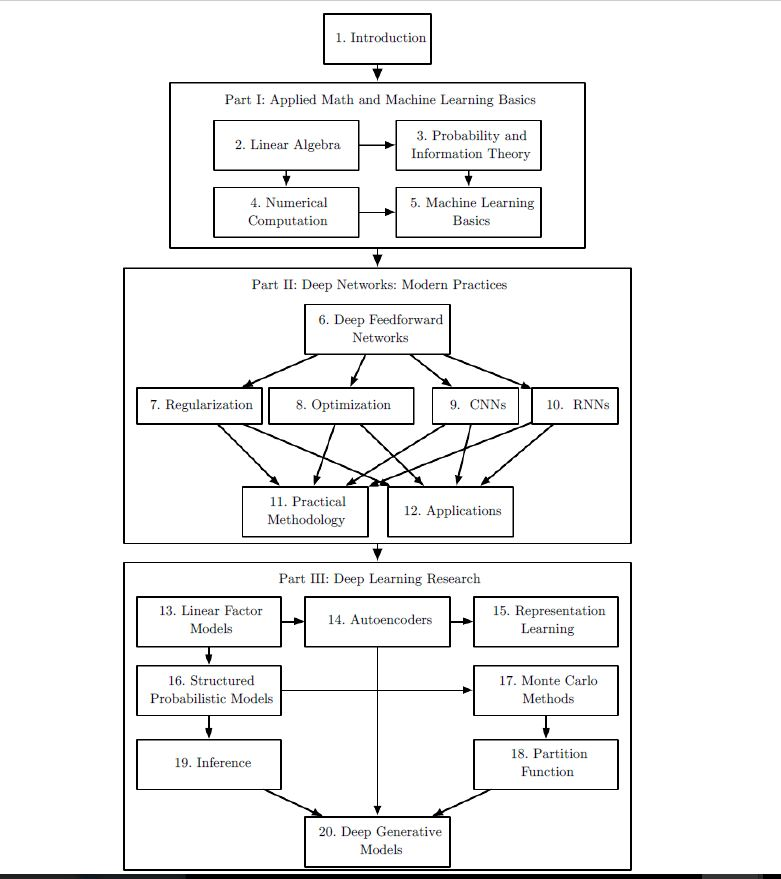

- [x] CS229 Machine Learning (Stanford) / Coursera's Machine Learning by Andrew Ng

- [ ] CS231n: Convolutional Neural Networks for Visual Recognition

- [ ] CS20 SI: TensorFlow for Deep Learning Research 

___________________________________________________________________________

## Deep Learning Book by Ian, Yoshua, Aaron

- [ ] Introduction

- [ ] Linear Algebra

- [ ] Probability and Information Theory

- [ ] Numerical Computation

- [ ] Machine Learning Basics

- [ ] Deep Feedforward Networks

- [ ] Regularization

- [ ] Optimization

- [ ] CNNs

- [ ] RNNs

- [ ] Practical Methodology

- [ ] Applications

**(Optional)**

- [ ] Linear Factor Models

- [ ] Autoencoders

- [ ] Representation Learning

- [ ] Structured Probabilistic Models

- [ ] Inference

- [ ] Monte Carlo Methods

- [ ] Partition Function

- [ ] Deep Generative Models 

